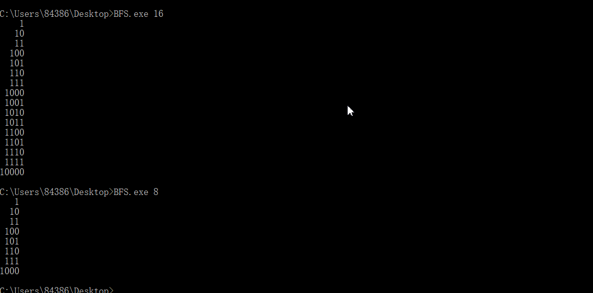

## Homework3

[Repo](https://github.com/chunzel16/CS460HW)

For this homework we are tasked with learning C#. Using Microsoft Visual Studio.
I need to convert the supplied java code to C#.

## Step1: Install Visual Studio IDE

I already took this class last year, so the Visual Studio already installed

## Step2: Download java file

I download and run it in Eclipse
Next I need to change the code and follow [Conventions](https://docs.microsoft.com/en-us/dotnet/standard/design-guidelines/general-naming-conventions)

## Coding

I create new branch called HW3 for this assignment, and add .gitignore file.

#### Conversion

First, for the Node.java

**java:**
```java
/** Singly linked node class. */

public class Node<T>
{
	public T data;
	public Node<T> next;
	
	public Node( T data, Node<T> next )
	{
		this.data = data;
		this.next = next;
	}
}

```

**C#**
```C#
/// <summary>
/// Singly linked node class. 
/// </summary>

public class Node<T>
{
	public T data;
	public Node<T> next;

	public Node(T data, Node<T> next)
	{
		this.data = data;
		this.next = next;
	}
}

```

The Node class is very similar between c# and java code.

#### Main.cs

I choose main class in second step.
The main function of this code is to implement Breadth-First Search.

```C#
using System;
using System.Collections.Generic;
using System.Text;
/// <summary>
/// application of Breadth-First Search to enumeration of states problems.
/// 
/// There are easier ways to generate a list of binary values, but this technique
/// is very general and a good one to remember for other uses.
/// </summary>

public class Print
{
	/// <summary>
	/// Print the binary representation of all numbers from 1 up to n.
	/// This is accomplished by using a FIFO queue to perform a level 
	/// order (i.e. BFS) traversal of a virtual binary tree that 
	/// looks like this:
	///                 1
	///             /       \
	///            10       11
	///           /  \     /  \
	///         100  101  110  111
	///          etc.
	/// and then storing each "value" in a list as it is "visited".
	/// </summary>
	internal static LinkedList<string> GenerateBinaryRepresentationList(int n)
	{
		// Create an empty queue of strings with which to perform the traversal
		LinkedQueue<StringBuilder> q = new LinkedQueue<StringBuilder>();

		// A list for returning the binary values
		LinkedList<string> output = new LinkedList<string>();

		if (n < 1)
		{
			// binary representation of negative values is not supported
			// return an empty list
			return output;
		}

		// Enqueue the first binary number.  Use a dynamic string to avoid string concat
		q.Push(new StringBuilder("1"));

		// BFS 
		while (n-- > 0)
		{
			// print the front of queue 
			StringBuilder sb = q.Pop();
			output.AddLast(sb.ToString());

			// Make a copy
			StringBuilder sbc = new StringBuilder(sb.ToString());

			// Left child
			sb.Append('0');
			q.Push(sb);
			// Right child
			sbc.Append('1');
			q.Push(sbc);
		}
		return output;
	}
    
```

In C# Push and Pop need capital letter, and I rename the class"Main" to "print" in order to avoid error.
using System is an important line, Using System means importing namespace.
This code appears class "LinkedQueue", so I choose to conversion it first.

```C#
public class LinkedQueue<T> : IQueueInterface<T>
{
	private Node<T> front;
	private Node<T> rear;

	public LinkedQueue()
	{
		front = null;
		rear = null;
	}

	public virtual T Push(T element)
	{
		if (element == null)
		{
			throw new System.NullReferenceException();
		}

		if (Empty)
		{
			Node<T> tmp = new Node<T>(element, null);
			rear = front = tmp;
		}
		else
		{
			// General case
			Node<T> tmp = new Node<T>(element, null);
			rear.next = tmp;
			rear = tmp;
		}
		return element;
	}

	public virtual T Pop()
	{
		T tmp = default(T);
		if (Empty)
		{
			throw new QueueUnderflowException("The queue was empty when pop was invoked.");
		}
		else if (front == rear)
		{ // one item in queue
			tmp = front.data;
			front = null;
			rear = null;
		}
		else
		{
			// General case
			tmp = front.data;
			front = front.next;
		}

		return tmp;
	}

	public virtual bool Empty
	{
		get
		{
			if (front == null && rear == null)
			{
				return true;
			}
			else
			{
				return false;
			}
```

In this class, another class "IQueueInterface" and "QueueUnderflowException" involved.
Conversion them first.

**IQueueInterface:**

```C#
public interface IQueueInterface<T>
{
	/// <summary>
	/// Add an element to the rear of the queue
	/// </summary>
	/// <returns> the element that was enqueued </returns>
	T Push(T element);

	/// <summary>
	/// Remove and return the front element.
	/// </summary>
	/// <exception cref="Thrown"> if the queue is empty </exception>
//Method 'throws' clauses are not available in .NET:
//ORIGINAL LINE: T pop() throws QueueUnderflowException;
	T Pop();

	/// <summary>
	/// Test if the queue is empty
	/// </summary>
	/// <returns> true if the queue is empty; otherwise false </returns>
	bool Empty {get;}
}
```
Method 'throws' clauses are not available in .NET

**QueueUnderflowException:**

```C#

public class QueueUnderflowException : Exception
{
  public QueueUnderflowException() : base()
  {
  }

  public QueueUnderflowException(string message) : base(message)
  {
  }
}
```
Next, I go back to the Main class

```C#
public static void Main(string[] args)
	{
		int n = 10;
		if (args.Length < 1)
		{
			Console.WriteLine("Please invoke with the max value to print binary up to, like this:");
			Console.WriteLine("\tjava Main 12");
			return;
		}
		try
		{
			n = int.Parse(args[0]);
		}
		catch (System.FormatException)
		{
			Console.WriteLine("I'm sorry, I can't understand the number: " + args[0]);
			return;
		}
		LinkedList<string> output = GenerateBinaryRepresentationList(n);
        // Print it right justified.  Longest string is the last one.
        // Print enough spaces to move it over the correct distance
        int maxLength = output.Last.Value.Length;
		foreach (string s in output)
		{
			for (int i = 0; i < maxLength - s.Length; ++i)
			{
				Console.Write(" ");
			}
			Console.WriteLine(s);
		}
```
In java, I use System.out.println in order to output something
But In C#, using Console.WriteLine(). If no "using System" in the first, There should be System.Console.WriteLine().
"s.length" means length of s in java. In C#, I need use Length.


## Output




    
    


