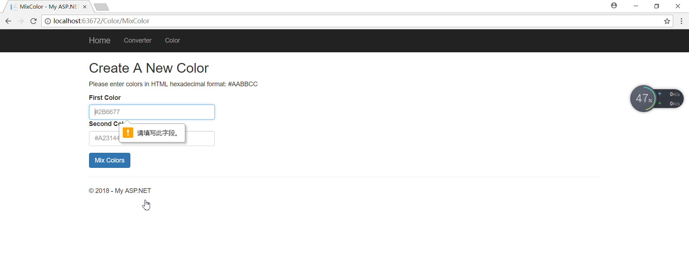

## Homework4

[Repo](https://github.com/chunzel16/CS460HW)

For this Homework, I used MVC APP5 in Microsoft Visual Studio.
For last year, I did temperature converter, so the mile to metric converter only need a little change.

### Step1: creating a new empty MVC project

Create a new project, and choose ASP.NET framework in Homework4 folder with branch HW4

### Homepage

I use the style in the assignment page.

```C#
<h2>Mile to Metric Converter</h2>
        <p>
            Mile to Metric Converter,convert miles to various units.
        </p>
        @Html.ActionLink("Go to Converter", "Converter", "Home", null, new { @class = "btn btn-primary btn-large" })
    </div>
    <div class="col-md-4">
        <h2>Create A New Color</h2>
        <p>Create a new color by blending two known colors.</p>
        @Html.ActionLink("Create A New Color", "MixColor", "Color", null, new { @class = "btn btn-primary btn-large" })
```


### Converter

Firstly, a converter interface is established, where the user enters miles and converts them to other units according to the requirements.
Define the mileage, unit, and final result of input.

```C#
[HttpGet]
        public ActionResult Converter()
        {
            //Input the miles
            string miles = Request.QueryString["mileInput"];
            //Input the metric
            string metric = Request.QueryString["units"];
            //Initializes input
            double newmile = 0;
```

Next, enter the transformation function.
When the input is not empty, the result is that a mile is about 1.6 kilometers, and the other units can be calculated by kilometers.

```C#
//Make sure what units user choose
                if (metric == "millimeters")
                {
                    newmile = newmile * 1609344.0;
                }
                else if (metric == "centimeters")
                {
                    newmile = newmile * 160934.4;
                }
                else if (metric == "meters")
                {
                    newmile = newmile * 1609.344;
                }
                else if (metric == "kilometers")
                {
                    newmile = newmile * 1.609344;
                }

                //Calculation result number
                string outputNumber = newmile.ToString();

                //Final output
                ViewBag.message = miles + " miles is equal to " + outputNumber + " " + metric;
            }
            return View();
```

After the calculation is finished, output the result at the bottom of the page.
Next, write the View file. Enter mileage on the left side of the page and select units the right side.
Every unit named "units" and mileage can be adjusted by buttons.
```C#
<label for="name"><b>Miles</b></label>
            <p><input type="number" step="0.001" min="0" id="mileNum" name="mileInput"></p>
            <h4 style="color:darkred; margin-top:160px;"><b>@ViewBag.message</b></h4>

        </div>

        <div class="col-sm-6">

            <ul style="list-style-type:none">
                <li><h4>Select a Unit</h4></li>
                <li>
                    <input type="radio" name="units" id="mm" value="millimeters" checked="checked">
                    <label for="mm">millimeters</label>
                </li>

                <li>
                    <input type="radio" name="units" id="cm" value="centimeters">
                    <label for="cm">centimeters</label>
                </li>

                <li>
                    <input type="radio" name="units" id="m" value="meters">
                    <label for="m">meters</label>
                </li>

                <li>
                    <input type="radio" name="units" id="km" value="kilometers">
                    <label for="km">kilometers</label>
                </li>
            </ul>
            <button type="submit" class="btn btn-primary">Convert</button>
        </div>
```

The following is the converter page.


### Create A New Color Page

Create a new controller called ColorController.
This part need use HTTPPost and Request.From

```C#
[HttpGet]
        public ActionResult MixColor()
        {
            ViewBag.show = false;
            return View();
        }
        [HttpPost]
        public ActionResult MixColor(string FirstColor, string SecondColor)
        {
            //Get the inputs
            FirstColor = Request.Form["FirstColor"];
            SecondColor = Request.Form["SecondColor"];
```

Next, add the red components together, add the green together, and add the blues together, then if any of the values is greater than 255, set it to 255, i.e. clip it at the maximum value of 255 or FF. 
C# has Color and ColorTranslator can help me to create mixed color.

```C#
 //make sure the color input are not null
            if (FirstColor != null && SecondColor != null)
            {
                ViewBag.show = true;
                Color FirstInput = ColorTranslator.FromHtml(FirstColor);
                Color SecondInput = ColorTranslator.FromHtml(SecondColor);

                //Calculate new color
                Color MixedColor = new Color();

                //Initialize RGB
                int red, green, blue = 0;

                //Make sure the value <= 255
                if (FirstInput.R + SecondInput.R > 255)
                {
                    red = 255;
                }
                else
                {
                    red = FirstInput.R + SecondInput.R;
                }

                if (FirstInput.G + SecondInput.G > 255)
                {
                    green = 255;
                }
                else
                {
                    green = FirstInput.G + SecondInput.G;
                }

                if (FirstInput.B + SecondInput.B > 255)
                {
                    blue = 255;
                }
                else
                {
                    blue = FirstInput.B + SecondInput.B;
                }
```

Next we need to calculate the color and output after mixing. using ViewBag to output result.
Define "ResultColor" is the color what I want.

```C#
 //define MixedColor
                MixedColor = Color.FromArgb(255, red, green, blue);
                //define the result to ResultColor
                string ResultColor = ColorTranslator.ToHtml(MixedColor);

                //Return all three color 
                ViewBag.color1 = "background:" + FirstColor;
                ViewBag.color2 = "background:" + SecondColor;
                ViewBag.newcolor = "background:" + ResultColor;
            }
            return View();
```

Next, set the appearance and layout in the cshtml file.
In each input box, enter the combined number representing the color, and I put an example to prompt the user.

```C#
<div class="form-group">
                @Html.Label("FirstColor", "First Color")
                @Html.TextBox("FirstColor", null, new { @class = "form-control", @pattern = "#[0-9A-Fa-f]{3,6}", @placeholder = "#2B6677", required = "required" })

                @Html.Label("SecondColor", "Second Color")
                @Html.TextBox("SecondColor", null, new { @class = "form-control", @pattern = "#[0-9A-Fa-f]{3,6}", @placeholder = "#A23144", required = "required" })
            </div>

```

Finally, output each color and result with the rcomfortable size.

```C#
<div class="col-sm-1" style="width:90px; height:90px; @ViewBag.color1; border-style:solid; border-width:1px"></div>
                <div class="col-sm-1" style="width:50px;"><h3>+</h3></div>
                <div class="col-sm-1" style="width:90px; height:90px; @ViewBag.color2; border-style:solid; border-width:1px"></div>
                <div class="col-sm-1" style="width:50px;"><h3>=</h3></div>
                <div class="col-sm-1" style="width:90px; height:90px; @ViewBag.newcolor; border-style:solid; border-width:1px"></div>
```

Following is the result of my attempt.


If I input the wrong format or enter nothing, the page will prompt the error, just like this.



The Chinese shown in the screenshot is "please enter this field".Because my browser's default language is Chinese and I can't modify it.


