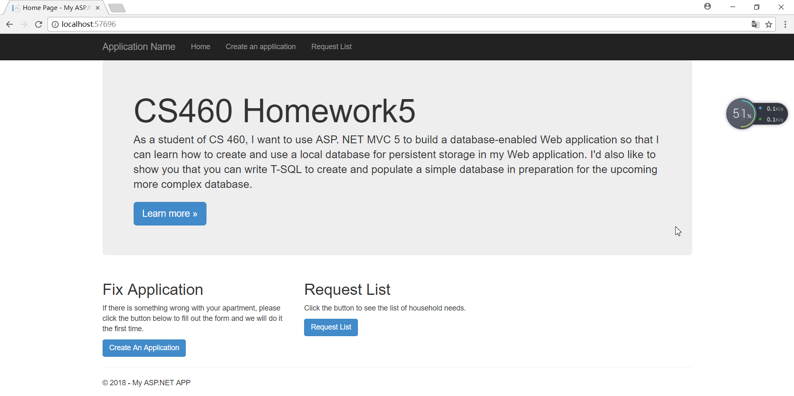
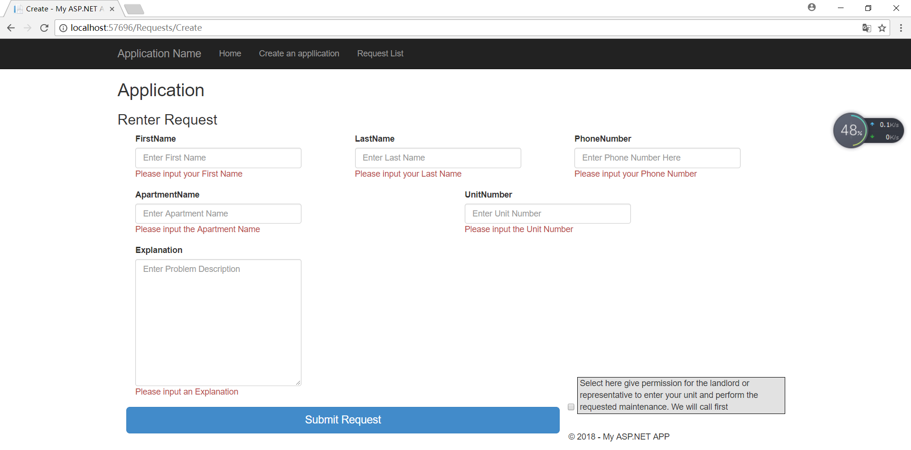
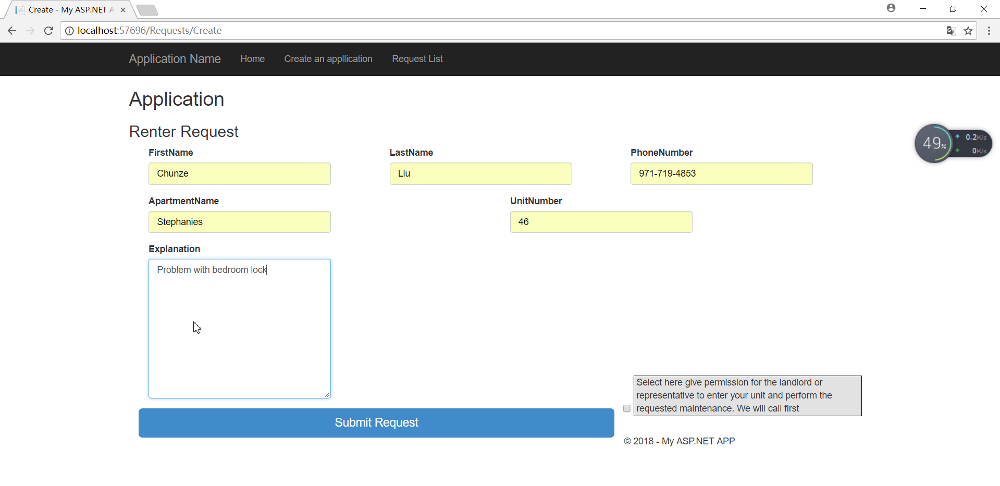
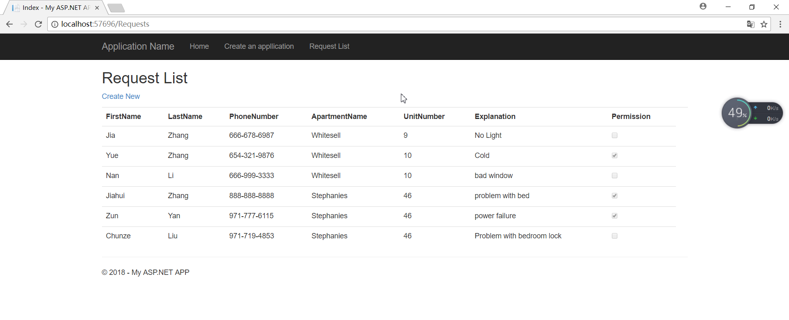

## Homework5

[Repo](https://github.com/chunzel16/CS460HW)

For this homework, using ASP.NET with simple database. I need create a page for renter application

### Strated

First, I need to create a database in APP_DATA, add the script files up. SQL and down. sql, and add five initial data to the table

```C#
CREATE TABLE [dbo].[Requests]
(
	[Id]  INT IDENTITY (1, 1) NOT NULL, 
    [FirstName] NVARCHAR(50) NOT NULL, 
    [LastName] NVARCHAR(50) NOT NULL, 
    [PhoneNumber] NVARCHAR(50) NOT NULL, 
    [ApartmentName] NVARCHAR(50) NOT NULL, 
    [UnitNumber] INT NOT NULL, 
    [Explanation] NVARCHAR(MAX)  NOT NULL, 
    [Permission] BIT  NOT NULL
	CONSTRAINT [PK_dbo.Requests] PRIMARY KEY CLUSTERED ([ID] ASC)
);

INSERT INTO dbo.Requests(FirstName, LastName, PhoneNumber, ApartmentName, UnitNumber, Explanation, Permission) VALUES
('Jia', 'Zhang', '666-678-6987', 'Whitesell', '9', 'No Light', 0),
('Yue', 'Zhang', '654-321-9876', 'Whitesell', '10', 'Cold', 1),
('Nan', 'Li', '666-999-3333', 'Whitesell', '10', 'bad window', 0),
('Jiahui', 'Zhang', '888-888-8888', 'Stephanies', '46', 'problem with bed', 1),
('Zun', 'Yan', '971-777-6115', 'Stephanies', '46', 'power failure', 1)
GO
```

After running the file, it can be found in the form that has been updated.

### Install EntityFramework and Add code to web.config

Use NuGet to install EntityFramework and add the necessary parts to web.config.
```C#
<connectionStrings>
    <add name="Requests"
     connectionString="Data Source=(LocalDB)\MSSQLLocalDB;AttachDbFilename=C:\Users\84386\460\Homework3\HW5\Homework5\Homework5\App_Data\Requests.mdf; Integrated Security=True"
         providerName="System.Data.SqlClient"
         />
   </connectionStrings>
```

### Context

This context class was placed in the DAL and it functioned as the connecting bridge between the classes in the project with the database.
```C#
public class RequestContext : DbContext
    {
        public RequestContext() : base("name=Requests")
            {

        }
        public virtual DbSet<Request> Requests { get; set; }

    }
```
### Model and View

This is part of my Model, and I declare that each part is required, and if the input is empty, the error message is displayed

```C#
 [Required(ErrorMessage = "Please input your Phone Number"), RegularExpression(@"^[2-9]\d{2}-\d{3}-\d{4}$", ErrorMessage = "Phone Number must be in format \"XXX-XXX-XXXX\"")]
        public string PhoneNumber { get; set; }

        [Required(ErrorMessage = "Please input the Apartment Name"), StringLength(50, ErrorMessage = "Input can be no longer than 50 Characters")]
        public string ApartmentName { get; set; }

        [Required(ErrorMessage = "Please input the Unit Number")]
        public int UnitNumber { get; set; }

        [Required(ErrorMessage = "Please input an Explanation")]
        public string Explanation { get; set; }
```
In Controller, I used HTTP POST and database related statements, and db. savechange will save my submission

```C#
public ActionResult Index()
        {
            return View(db.Requests.ToList());
        }
        public ActionResult Create()
        {
            return View();
        }
        [HttpPost]
        public ActionResult Create(Request request)
        {
            if (ModelState.IsValid)
            {
                db.Requests.Add(request);
                db.SaveChanges();
                return RedirectToAction("Index");
            }
            return View(request);
        }
```

Next, I designed my page layout to make it look almost the same as the homework display page.

```C#
<div class="container">
        <div class="form-group col-md-12">
            @Html.LabelFor(model => model.Explanation)
            @Html.TextAreaFor(model => model.Explanation, new { @class = "form-control", @rows = 10, placeholder = "Enter Problem Description" })
            @Html.ValidationMessageFor(model => model.Explanation, "", new { @class = "text-danger" })
        </div>
    </div>
        <div class="form-group">
            <div class="col-md-8">
                <button type="submit" class="btn btn-primary btn-lg btn-block">Submit Request</button>
                </div>
            <div class="col-md-4">
                <div class="checkbox" style="border: 1px solid black; background-color:#E2E2E2; padding-left:3px; margin-top:-50px;">
                    @Html.LabelFor(model => model.Permission, "Select here give permission for the landlord" +
                               " or representative to enter your unit and perform the requested maintenance. We will call first")
                    @Html.EditorFor(model => model.Permission)
                    @Html.ValidationMessageFor(model => model.Permission, "", new { @class = "text-danger" })
                </div>
            </div>
```

List all requests on another page.

```C#
<table class="table">
    <tr>
        <th>
            @Html.DisplayNameFor(model => model.FirstName)
        </th>
        <th>
            @Html.DisplayNameFor(model => model.LastName)
        </th>
        <th>
            @Html.DisplayNameFor(model => model.PhoneNumber)
        </th>
```

Following is my homepage, users can choose to click on links above or below.




### Final page

Following is my create page, if user input nothing, it will be error message



If users fill in the form in the correct format, click Submit.



Next, all recent requests are listed in the following pages.



