## Homework9

[Repo](https://github.com/chunzel16/CS460HW)

This is the last homework for this term!

### Set Azure

Start free in Azure

### Create Resource Group

I need create a resource group as first

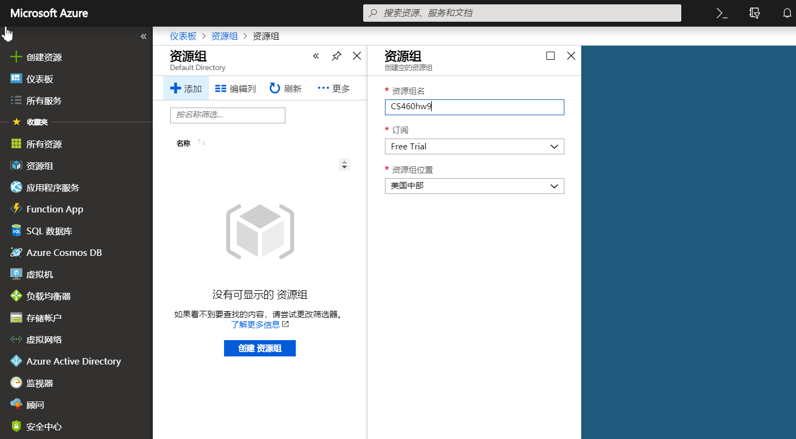

### SQL Database

Create a SQL database and a SQL sever
Remember the user ID and password, they are important for me

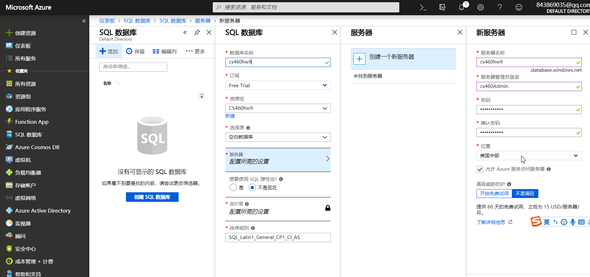

### Firewalls

Add a firewall rule

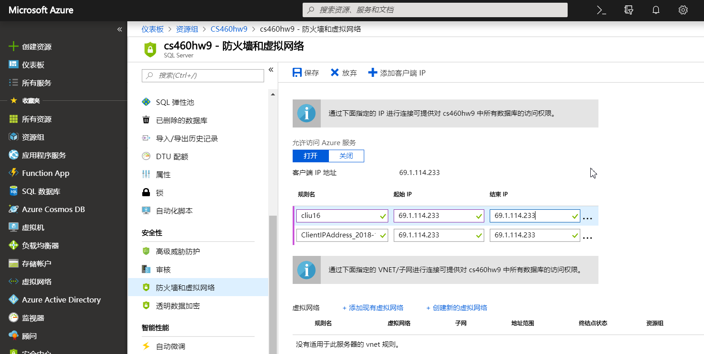

### SQL Sever

Go to SQL Sever Managment and sign up by using ID and password

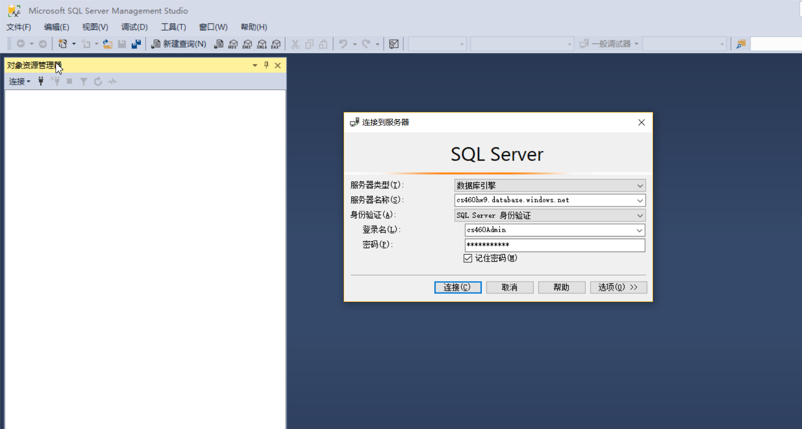

using up.sql create tables

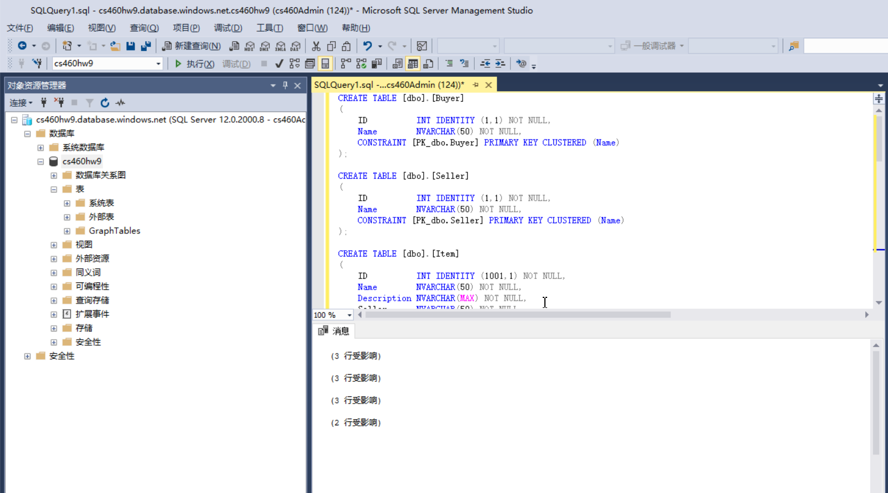

### Connect Database to Visual Studio

Open sever explorer 
under Azure, right click SQL database, select SQL sever object explorer
Add SQL sever, and connect

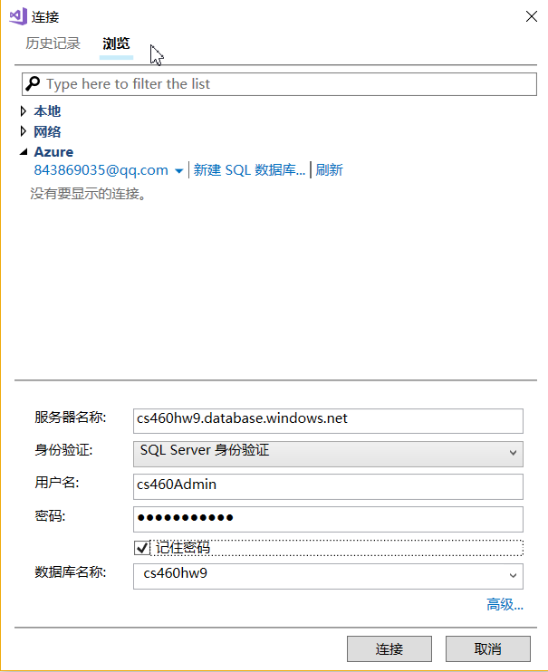

### Add connectionString in web config

go to the SQL database and copy the connection string from the ADO.NET section.
paste the code in connectstring
test VS working

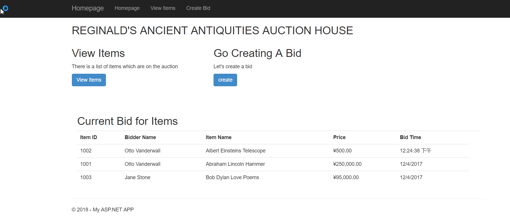

### Web APP

Create a web APP

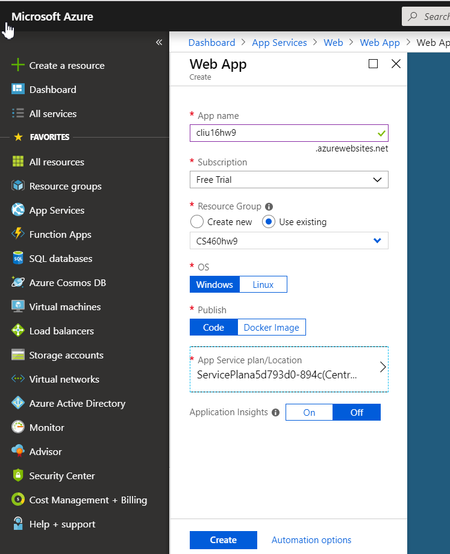

Go to application setting
create connection strings

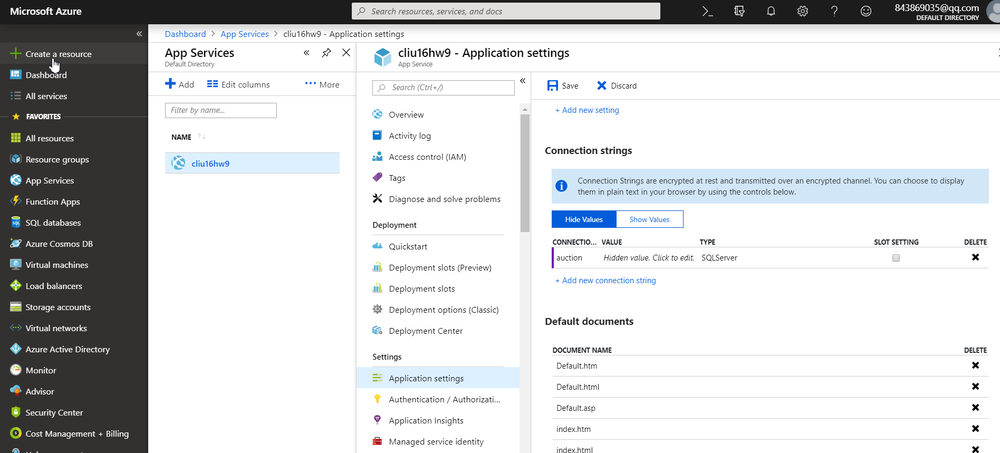

### publish

Go to Visual Studio
Click Bulid, publish
Select Azure, from existing 

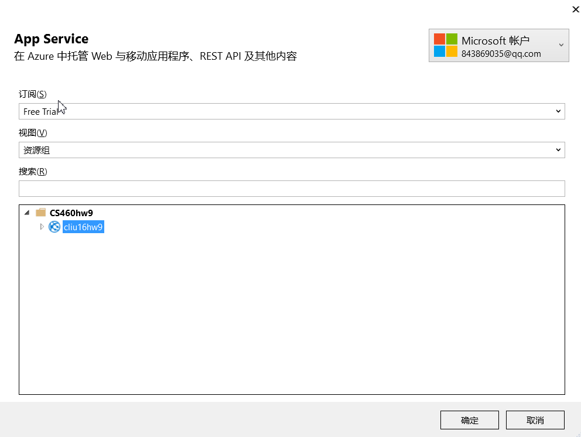

### Result

The website

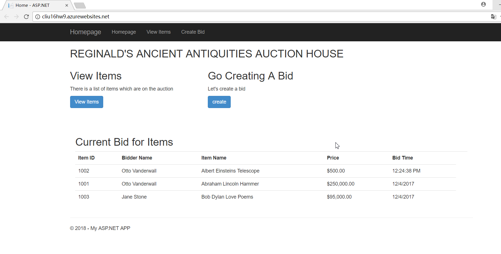

### Video

<a href="https://www.youtube.com/watch?v=ANQDSlQVT20">Homework9(Video)</a>