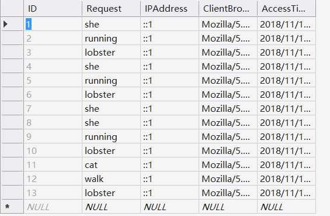

##  Homework7

[Repo](https://github.com/chunzel16/CS460HW)


Be able to write a MVC web application that employs AJAX to build responsive views

### APIKEY

First, I built a new app on Giphy website and got my own password.
Key needs to be hidden, so I created AppSetting.config file outside of repo, and write the following code.
```
<appSettings>
    <add key="APIKEY" value="My Key"/>
</appSettings>
```

And then call the password in controller.
```
string apiKey = System.Web.Configuration.WebConfigurationManager.AppSettings["APIKEY"];
            string getURL = "https://api.giphy.com/v1/stickers/translate?api_key="+apiKey+"&s=" + txt;
            
```

To ensure that there is no navigation bar in the final result, I enter route.config.

```
              routes.MapRoute(
               name: "Search",
               url: "{controller}/{action}/{search}",
               defaults: new { controller = "Home", action = "Sticker", }
               );
```

### js and AJAX

User input will eventually return to JSON data, so we need to use JavaScript files to convert them to the results we want.
```
var txt = $('#text-input').val();

            var lastitem = txt.split(" ").pop();


            var source = "Home/Sticker/" + txt;
            if (!boring(lastitem)) {
                $.ajax({
                    type: "GET",
                    dataType: "json",
                    data: { "txt": lastitem },
                    url: source,
                    success: showGifs,
                    error: errorOnAjax
```
```
string convString = new StreamReader(data).ReadToEnd();
            var serialize = new System.Web.Script.Serialization.JavaScriptSerializer();
            var jsonObj = serialize.DeserializeObject(convString);
            data.Close();
            getResponce.Close();

            return Json(jsonObj, JsonRequestBehavior.AllowGet);
```

### database

Create db
```
CREATE TABLE [dbo].[Requestlists] (
    [ID]            INT            IDENTITY (1, 1) NOT NULL,
    [Request]		NVARCHAR (MAX) NOT NULL,
    [IPAddress]		NVARCHAR (MAX) NOT NULL,
	[ClientBrowser]	NVARCHAR (MAX) NOT NULL,
    [AccessTime]    DATETIME       NULL,

    CONSTRAINT [PK_dbo.Requestlists] PRIMARY KEY CLUSTERED ([ID] ASC)
	
);
```

In my Model

```
public class Requestlist
    {

        public int ID { get; set; }

        public DateTime AccessTime { get; set; }

        public string Request { get; set; }

        public string IPAddress { get; set; }

        public string ClientBrowser { get; set; }
    }
}

```

### Final Result

<a href="https://www.youtube.com/watch?v=RBBklakGiMA">Homework7(Video)</a>

When I returned to Visual Studio, the new data was added to the table.


            
            